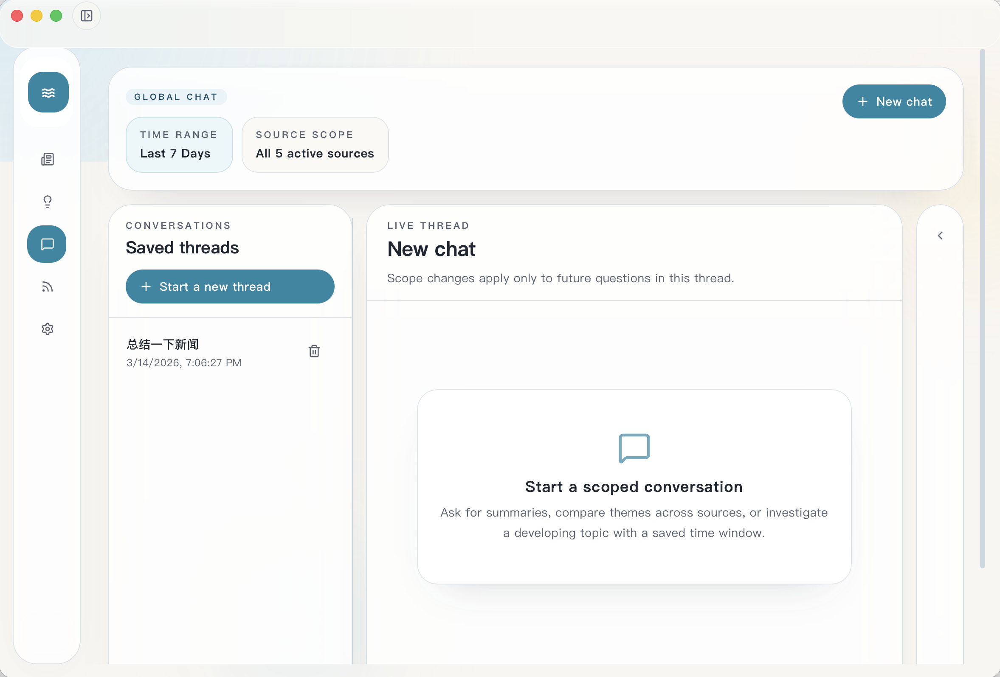
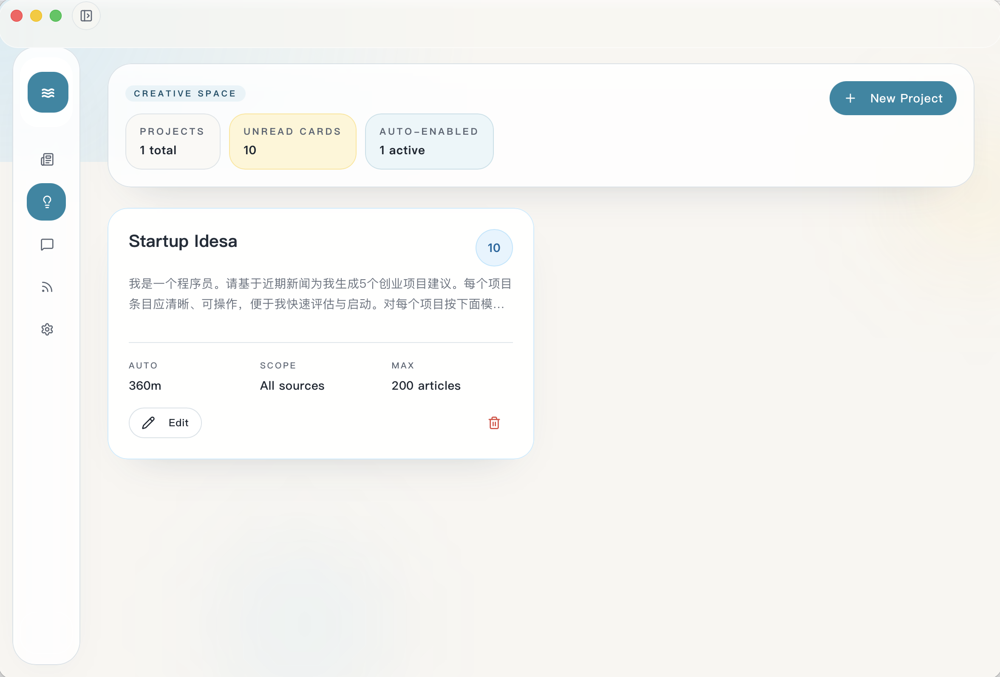
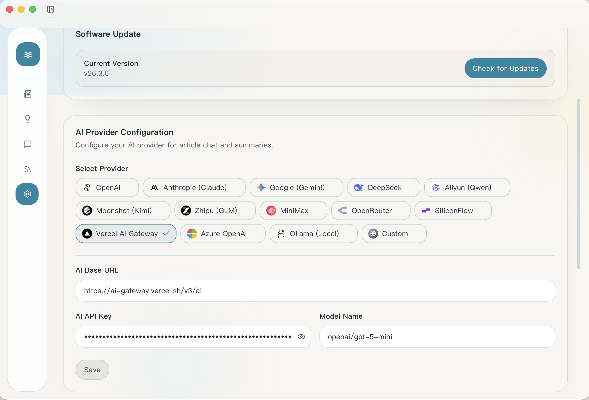

# News Viber

Desktop AI Intelligence Workspace for news, chat, and ideas.

[中文文档](./README_ZH.md) · [Releases](https://github.com/shipengtaov/newsviber/releases) · [Issues](https://github.com/shipengtaov/newsviber/issues/new)

## Overview

News Viber brings source tracking, scoped AI chat, and automated output generation into one desktop workspace. It is built for people who want a tighter loop between collecting signal, asking better questions, and turning raw coverage into reusable results.

At a glance:

- RSS / Atom sources
- Scoped AI chat
- Automated outputs from news
- Desktop app with local storage
- Configurable AI providers

## Why News Viber

### Collect

Track multiple RSS / Atom sources in one place, fetch them on a schedule, and keep a local archive you can scan later. News Viber keeps intake simple so the interesting work starts faster.

### Ask

Use cross-source chat with saved scopes and time ranges to compare coverage, investigate a topic, or continue a thread without rebuilding context every time.

### Create

Turn collected articles into reusable output workflows. Define the result you want, then let projects watch scoped news automatically and generate reports, briefs, ideas, or any other expected output when new information arrives.

### Configure

Switch providers, models, and gateways from one settings surface. Keep updates, cleanup behavior, and language preferences inside the app instead of scattered across scripts.

## Screens

<table>
  <tr>
    <td width="50%">
      
      <p><strong>News overview</strong><br/>Scan active sources, unread counts, and stored articles in one workspace.</p>
    </td>
    <td width="50%">
      
      <p><strong>Cross-source chat</strong><br/>Compare answers across sources with saved scope and time filters.</p>
    </td>
  </tr>
  <tr>
    <td width="50%">
      
      <p><strong>Automated outputs</strong><br/>Turn scoped source material into reports, briefs, ideas, or any other expected output.</p>
    </td>
    <td width="50%">
      
      <p><strong>Provider settings</strong><br/>Manage AI providers, models, updates, and housekeeping in one place.</p>
    </td>
  </tr>
</table>

## Features

- News overview with source filters, unread counts, search, and local article storage
- Source management for RSS / Atom feeds with manual or scheduled refresh intervals
- Cross-source AI chat with reusable thread scope and time-range controls
- Output projects that can automatically generate any desired output from scoped news articles
- Configurable AI provider settings for hosted, gateway, local, and custom endpoints
- Built-in software update checks through the Tauri updater
- Local housekeeping tools for stored article cleanup
- Multi-language UI with English, Simplified Chinese, Traditional Chinese, Japanese, French, German, and Italian

## Download

Download the latest desktop builds from [GitHub Releases](https://github.com/shipengtaov/newsviber/releases).

Current release targets:

- macOS Apple Silicon
- macOS Intel
- Windows x64

Linux packaging is not part of the current release flow.

## Run from Source

### Prerequisites

- Node.js and npm
- Rust toolchain
- Tauri build prerequisites for your platform

### Install

```bash
npm install
```

### Start the desktop app in development

```bash
npm run tauri dev
```

### Run tests

```bash
npm run test
```

### Build the frontend bundle

```bash
npm run build
```

## AI Providers

News Viber currently includes built-in configuration for these providers:

- Hosted models: OpenAI, Anthropic (Claude), Google (Gemini), DeepSeek, Aliyun (Qwen), Moonshot (Kimi), Zhipu (GLM), MiniMax
- Gateways and compatible APIs: OpenRouter, SiliconFlow, Vercel AI Gateway, Azure OpenAI
- Local and custom endpoints: Ollama, Custom

Provider settings are stored in the app and can be switched from a single configuration surface.

## Tech Stack

- Tauri 2
- React 19
- TypeScript
- Vite
- Rust
- SQLite via Tauri SQL plugin
- Vercel AI SDK and compatible provider integrations

## License

[Apache License 2.0](./LICENSE)
